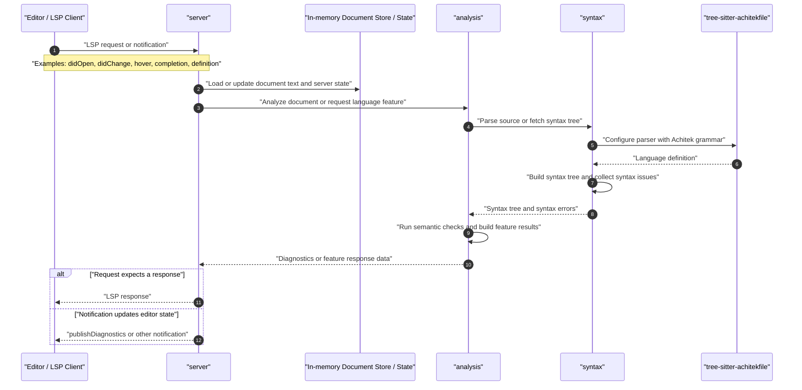

# Architecture

This document describes the current workspace layout, crate responsibilities,
and request flow for the Achitekfile language server.

## Workspace Structure

This repository is a Rust workspace with three members:

- `server`
  Owns LSP protocol handling, editor communication, document lifecycle, and
  in-memory server state.
- `analysis`
  Owns editor-facing language analysis. It consumes parsed syntax trees and
  produces diagnostics and, later, features such as hover, symbols,
  definitions, references, and rename support.
- `syntax`
  Owns parsing Achitek source with Tree-sitter, source ranges, syntax-tree
  wrappers, and syntax-level errors.

The Achitek Tree-sitter grammar itself lives outside this workspace and is used
by `syntax` through the `tree-sitter-achitekfile` dependency.

## Dependency Direction

The intended dependency layering is:

`server -> analysis -> syntax -> tree-sitter-achitekfile`

This direction matters:

- `server` should know about LSP, but not Tree-sitter details
- `analysis` should know about language meaning, but not transport concerns
- `syntax` should know about parsing, but not semantic meaning or LSP types

Keeping these boundaries sharp makes the code easier to test and easier to
change as the server grows.

## Current State

Today, the workspace has the following implemented pieces:

- `syntax`
  Parses Achitek source into a `SyntaxTree`
- `syntax`
  Collects recoverable syntax issues from Tree-sitter error and missing nodes
- `analysis`
  Calls into `syntax` and translates syntax issues into analysis diagnostics
- `server`
  Exists as a crate, but has not yet been wired into the analysis pipeline

## Request Flow

## Document Store / State

The server will maintain an in-memory view of open documents so analysis runs
against the latest editor contents rather than only what is on disk.

This state will typically include:

- document URI
- document version
- current text
- later, cached analysis or syntax results

## Design Principles

- Keep protocol code in `server`
- Keep parsing code in `syntax`
- Keep language meaning in `analysis`
- Prefer crate-local types over leaking Tree-sitter or LSP details across layers
- Grow from document-local features first, then add cross-file semantics

## Near-Term Milestones

1. Wire `server` to store open documents and call `analysis::analyze()`
2. Publish diagnostics on open and change
3. Expand `analysis` from syntax diagnostics into semantic validation
4. Add symbol, hover, and definition support on top of the same layering
